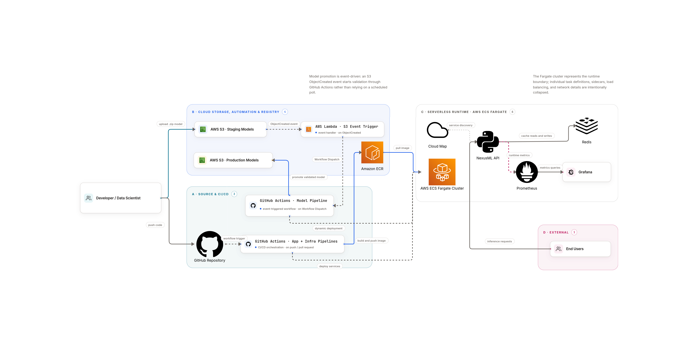
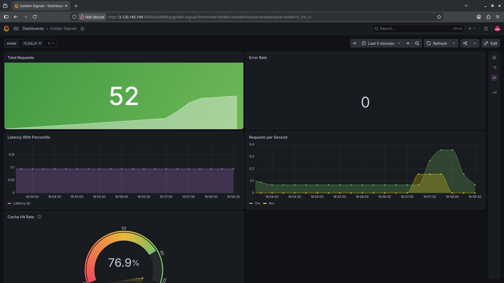

# NexusML

High-performance, Cloud-Native platform for deploying and monitoring machine learning models. The architecture is built on a microservices approach utilizing **FastAPI**, **ONNX Runtime**, and **Redis**, deployed in a serverless **AWS ECS Fargate** environment with fully automated CI/CD pipelines.

## Key Features

*   **Dynamic Model Scaling (IaC):** Automated parsing of S3 buckets paired with GitHub Actions Matrix to parallel-deploy independent microservices for every single ML model.
*   **Fail-Fast Architecture & Graceful Degradation:** Models are loaded directly into RAM during container startup (FastAPI Lifespan). The container refuses incoming traffic until the model is fully initialized. The system also supports graceful degradation, remaining operational even if the Redis cache drops.
*   **Inference Optimization:** Powered by ONNX Runtime for ultra-fast predictions, heavily optimized with **Redis** caching (using SHA-256 hashing for input features).
*   **Advanced Monitoring:** Automated Service Discovery via AWS Cloud Map and ECS API. Seamless collection of "Golden Signals" (Latency, Error Rate, Traffic) and custom Cache Hit Rates using **Prometheus** and **Grafana**.
*   **Automated Alerting:** Real-time Email notifications and Markdown summaries for all CI/CD deployments and model validation results.

## Infrastructure Architecture



The project consists of four primary microservices deployed within an AWS ECS cluster:
1.  **NexusML API** (Dynamic auto-scaling container count based on the number of production models in S3).
2.  **Redis** (In-memory database for inference caching and latency reduction).
3.  **Prometheus** (Time-series database for metrics with automatic API container discovery).
4.  **Grafana** (Visualization platform with automated dashboard provisioning).

## Project Structure

```text
.
├── .github/workflows/       # CI/CD Pipelines (App, Model, Infra) with Email Alerting
├── app/                     # FastAPI application source code
│   ├── main.py              # Entry point, Lifespan events, Endpoints
│   ├── ml_service.py        # ONNX inference logic
│   ├── model_loader.py      # AWS S3 integration
│   ├── cache.py             # Redis caching logic
│   └── schemas.py           # Pydantic models (data validation)
├── infrastructure/          # Infrastructure configurations and Dockerfiles
│   ├── grafana/             # Dashboards (Golden Signals) and Datasources
│   ├── prometheus/          # Metrics collection rules (Service Discovery)
│   └── redis/               # In-memory caching setup
├── scripts/                 # Utility scripts (S3 Sync, Pipeline automation)
├── tests/                   # Pytest suites (Coverage > 94%)
├── docker-compose.yml       # Local development environment
├── Dockerfile               # Production image configuration for FastAPI
├── requirements.txt         # Python package dependencies
└── task-def-template.json   # AWS ECS Task Definition template for dynamic injection dynamic deployment
```

## CI/CD Pipelines (GitHub Actions)

The project utilizes a decoupled pipeline strategy for maximum flexibility:

*   **app_pipeline.yml (App CI/CD):**
Triggered on changes in `app/` or `tests/`. Runs linting (Flake8), executes Pytest suites, builds the API Docker image, pushes it to Amazon ECR, dynamically scans `production/` in S3, and updates all corresponding ECS services in parallel using a Matrix strategy.

*   **model_pipeline.yml (Model Promotion):**
Triggered automatically via AWS Lambda Webhook (workflow_dispatch) when a new archive is uploaded to S3. Downloads `.zip` archives from S3 (`staging/`), runs strict validation tests (Tensor Shape, Accuracy tolerance, Latency constraints), promotes validated models to `production/`, and orchestrates ECS container updates.

*   **infra_pipeline.yml (Infra CI/CD):**
Manages core underlying services (Redis, Prometheus, Grafana). Automatically builds infrastructure images and registers them into AWS Service Discovery (Cloud Map).

*All pipelines automatically generate GitHub Step Summaries and send status Email notifications upon completion.*

## API Endpoints

### **GET /health**
Returns the readiness status of the service (checks if the model is loaded in memory and Redis is reachable). Primarily used by the AWS Application Load Balancer. Dynamically shifts to `"status": "degraded"` if caching layers fail, while keeping the API alive.\
**Example Response:**

```json
{
  "status": "healthy",
  "model": "rf_iris_v1",
  "services": {
    "api": "connected",
    "redis": "connected",
    "model_loaded": true
  }
}
```

### **POST /predict**
Executes an inference prediction based on the provided input features. Validated strictly via Pydantic schemas.\
**Example Request:**

```json
{
  "features": [5.1, 3.5, 1.4, 0.2]
}
```

**Example Response (Cache Miss):**

```json
{
  "model_used": "rf_iris_v1",
  "prediction": 0.0,
  "status": "success (computed)"
}
```

**Example Response (Cache Hit):**

```json
{
  "model_used": "rf_iris_v1",
  "prediction": 0.0,
  "status": "success (from cache)"
}
```

## Monitoring (Grafana)



The platform features an auto-provisioned Golden Signals dashboard that tracks:

1) **Total Requests:** The absolute volume of inference requests.

2) **Requests per Second:** RPS broken down by HTTP status codes (200, 400, 500).

3) **Latency 95th Percentile:** Core API and ML inference performance.

4) **Error Rate:** Percentage of 5xx internal server errors.

5) **Cache Hit Rate:** Operational efficiency of the Redis caching layer.

The dashboard supports dynamic filtering for individual active models via the `$model` variable dropdown.